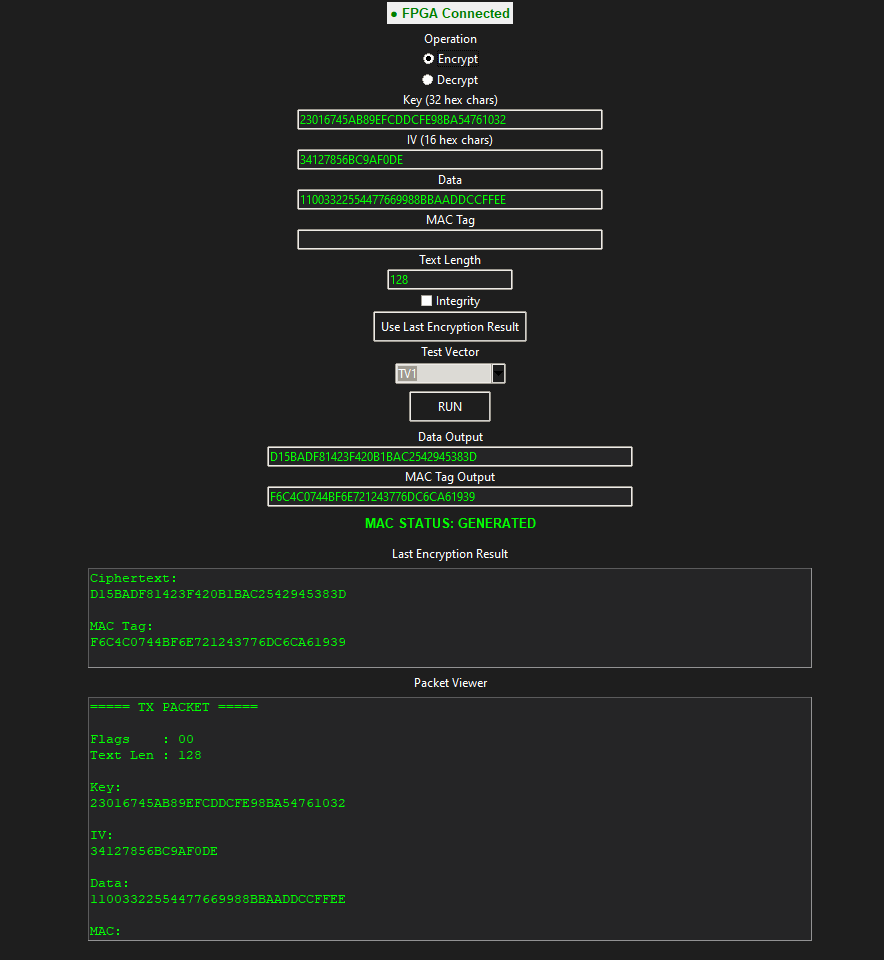
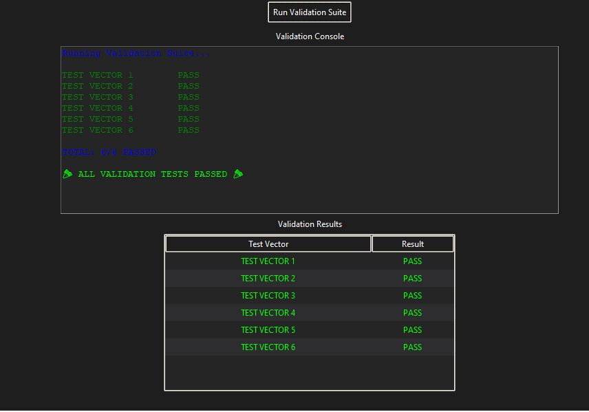
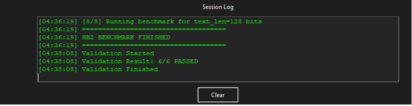
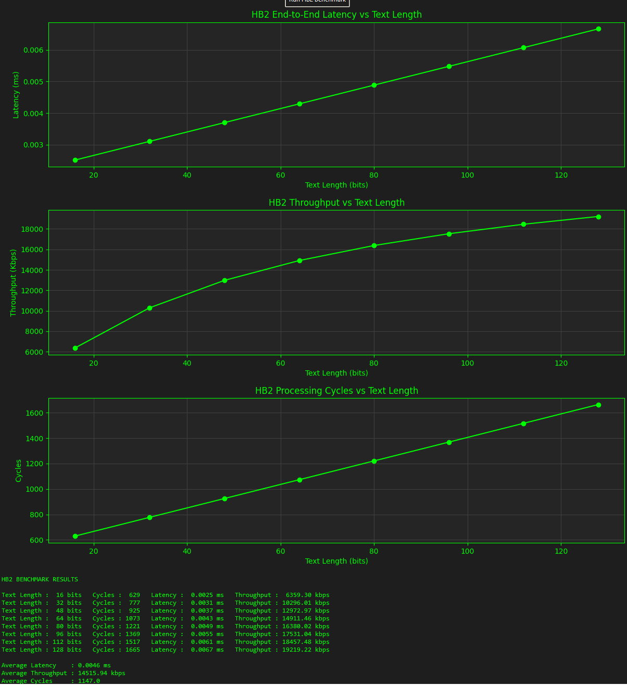
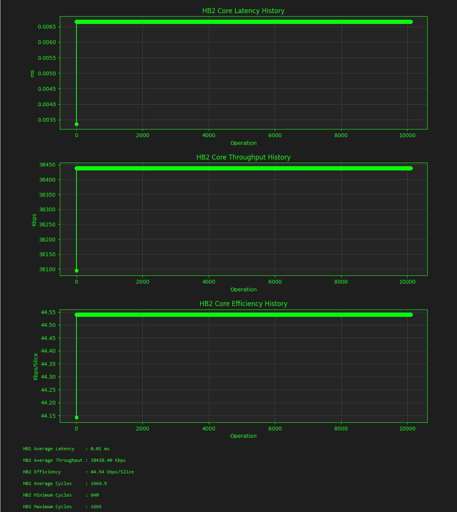
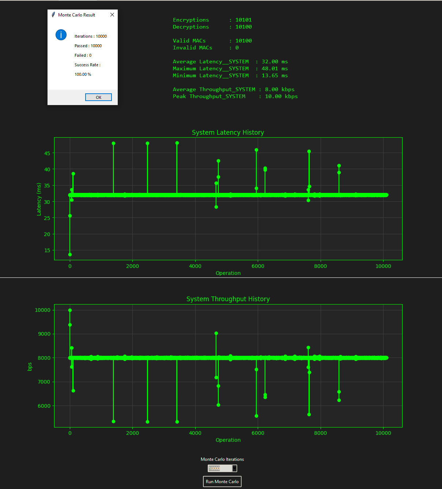

# Hummingbird-2 FPGA Implementation for Lightweight Authenticated Encryption in IoT

## Overview

This project presents a complete FPGA-based implementation of the Hummingbird-2 lightweight authenticated encryption algorithm on a Digilent Basys3 development board featuring the Xilinx Artix-7 XC7A35T FPGA.

Unlike the original thesis implementation, which focused on algorithmic architecture exploration, this work redesigns the cipher specifically for FPGA deployment and real-time operation. The final system integrates a custom UART communication protocol, clock domain crossing (CDC) mechanisms, a Python-based graphical user interface (GUI), automated validation tools, benchmarking utilities, and Monte Carlo reliability testing.

The implementation demonstrates a complete hardware/software co-design workflow, enabling authenticated encryption and decryption operations directly on physical FPGA hardware.

---

## Key Features

### FPGA Hardware Accelerator

- Full Hummingbird-2 encryption support
- Full Hummingbird-2 decryption support
- MAC generation
- MAC verification
- Authenticated encryption workflow
- Real-time operation on physical FPGA hardware

### FPGA-Oriented Architecture Redesign

The original architecture was redesigned to significantly reduce FPGA resource utilization.

#### Encryption Core

Instead of instantiating multiple encryption blocks in parallel:

- Single Encryption Block
- Iterative round-based processing
- Resource sharing across rounds

#### Decryption Core

Instead of multiple parallel decryption modules:

- Single Decryption Block
- Iterative round execution
- Reduced LUT and register utilization

#### WD Function Optimization

Instead of using four parallel WD transformation units:

- One reusable WD block
- Round-based execution
- Lower hardware footprint

This approach trades throughput for a significant reduction in FPGA resource consumption while maintaining full functionality.

---

## System Architecture

The complete system consists of:

```text
                 ┌─────────────────────┐
                 │   Python GUI        │
                 │  (PC Application)   │
                 └──────────┬──────────┘
                            │ UART
                            ▼
                 ┌─────────────────────┐
                 │ UART Packet Layer   │
                 └──────────┬──────────┘
                            │
                 ┌──────────▼──────────┐
                 │ CDC Synchronization │
                 └──────────┬──────────┘
                            │
                  100 MHz → 250 MHz
                            │
                            ▼
                 ┌─────────────────────┐
                 │ Hummingbird-2 Core  │
                 └─────────────────────┘
```

---

## Clocking Scheme

The design operates using multiple clock domains.

| Clock Domain | Frequency |
|-------------|------------|
| UART Logic | 100 MHz |
| System Logic | 100 MHz |
| HB2 Core | 250 MHz |

Clock Domain Crossing (CDC) synchronization is implemented between the UART interface and the cryptographic core.

---

## Hardware Platform

### FPGA Board

- Digilent Basys3

### FPGA Device

- Xilinx Artix-7 XC7A35T

### Communication Interface

- UART
- 115200 baud

---

## UART Packet Protocol

### Transmit Packet

58-byte packet containing:

- Operation flags
- Key
- Initialization Vector
- Plaintext/Ciphertext
- MAC information
- Length metadata

### Receive Packet

35-byte packet containing:

- Ciphertext or plaintext
- Generated MAC
- Status information

---

## FPGA Resource Utilization

### Device: XC7A35T

| Resource | Used | Available | Utilization |
|-----------|--------|-----------|------------|
| LUTs | 2533 | 20800 | 12.18% |
| Registers | 4228 | 41600 | 10.16% |
| I/O | 20 | 106 | 18.87% |
| MMCM | 1 | 5 | 20.00% |

The implementation occupies only a small fraction of the available FPGA resources, leaving significant headroom for future expansion.

---

## Timing Results

### Timing Closure

| Metric | Result |
|----------|---------|
| WNS | +0.001 ns |
| TNS | 0.000 ns |
| Failing Endpoints | 0 |

All timing constraints were successfully met.

### Core Frequency

- Hummingbird-2 Core: 250 MHz

---

## Python GUI

A custom Python GUI was developed for interacting with the FPGA accelerator.

Features include:

- Encrypt operations
- Decrypt operations
- MAC verification
- UART packet visualization
- Session logging
- Validation suite
- Benchmark execution
- Monte Carlo testing

### Main Interface



---

## Validation Framework

An automated validation suite was developed to verify functionality against known test vectors.

### Validation Results

- 6 / 6 test vectors passed
- 100% success rate



---

## Session Logging

The GUI provides real-time logging of:

- Encryption operations
- Decryption operations
- Validation execution
- Benchmark execution
- Packet transactions



---

## Benchmark Results

A dedicated benchmark framework was developed to evaluate the hardware accelerator using varying text lengths.

Tested message lengths:

```text
16, 32, 48, 64, 80, 96, 112, 128 bits
```

### Average Results

| Metric | Value |
|----------|----------|
| Average Latency | 0.0046 ms |
| Average Throughput | 14515.94 kbps |
| Average Cycles | 1147 |

### Peak Throughput

```text
19219.22 kbps
```

### Benchmark Visualization



---

## HB2 Core Statistics

The hardware core was also evaluated independently from UART and GUI overhead.

### Results

| Metric | Value |
|---------|---------|
| Average Throughput | 38438.40 kbps |
| Efficiency | 44.54 kbps/slice |
| Average Cycles | 1664.9 |
| Minimum Cycles | 840 |
| Maximum Cycles | 1665 |



---

## Monte Carlo Reliability Testing

A Monte Carlo testing framework was developed to evaluate long-term reliability.

### Test Configuration

- 10,000 iterations
- Randomized operations
- Randomized inputs
- Encrypt/Decrypt verification
- MAC validation

### Results

| Metric | Value |
|---------|---------|
| Iterations | 10000 |
| Passed | 10000 |
| Failed | 0 |
| Success Rate | 100% |



---

## Project Structure

```text
rtl/
│
├── HB2 Core
├── Encryption Core
├── Decryption Core
├── UART RX
├── UART TX
├── Packet Controller
├── CDC Logic
└── Top Wrapper

constraints/
│
└── XDC Constraints

python_gui/
│
├── GUI Application
├── Benchmark Framework
├── Validation Suite
├── Monte Carlo Framework
└── UART Communication

testbenches/
│
└── Simulation Environment

images/
│
└── Project Screenshots
```

---

## Future Work

Potential future extensions include:

- AXI-based integration
- Hardware/software co-design on Zynq platforms OR Integration of a MicroBlaze soft processor for embedded accelerator control
-  Higher-bandwidth communication interfaces to overcome UART limitations
- Throughput-oriented parallel HB2 architectures targeting high-performance applications
- Standalone embedded operation without requiring an external PC
- Comparative FPGA evaluation against other lightweight cryptographic algorithms

---

## Author

**Giorgos Ntakos**

MSc Thesis Extension Project

University of West Attica

FPGA-Based Lightweight Cryptography Research

---
